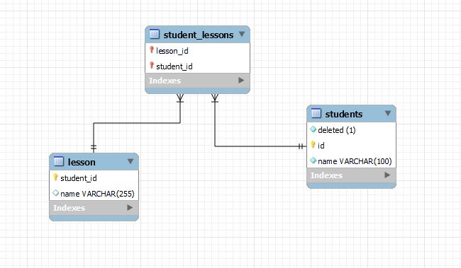

# JPA(Java Persistence API)

JPA aslında bir kuraldır. ORM araçlarının çok ve her birinin kendi yazım şekli olması sebebiyle kütüphane karmaşıklığı ortaya çıkıyordu. JPA'in ortaya çıkmasıyla bu karmaşıklık giderilmiş ve bir standart ortaya çıkmıştır. Bu standar sayesinde kullanılan ORM aracı ne olursa olsun aynı metod adları aynı sonucu vericektir.

## JPA kurulumu

- Jpa kurmak için, jpa imlementasyonunu yapan orm araçlarını kurmak yeterlidir. Hibernate, EclipseLink gibi araçlar bu implementasyonu sağlarlar.

```xml
<dependency>
    <groupId>org.springframework.boot</groupId>
    <artifactId>spring-boot-starter-data-jpa</artifactId>
</dependency>
```

- JPA ile birlikte kullanılacak veritabanının JDBC sürücüsü'de projeye dahil edilmelidir.
- JPA kullanmak için 2 farklı yöntem vardır anotasyon kullanımı ve xml kullanımı, her ikiside birlikte kullanılabilir ancak xml anotasyonları ezer.

JPA'in sağladığı standart class ve interface'ler aşağıdaki gibidir.

| Element             | Tanım                             |
|---------------------|-----------------------------------|
|**Entity**|   Java sınıflarını veritabanı tablolarına eşleştirmek için kullanılır.                                |
|**Query**| Veritabanı tablolarıyla eşleştirilen ve Entity adı verilen sınıflardan yaratılan objeler üzerinden sorgu yaratmak için kullanılır. |
|**EntityManager**| Persistence işlemlerini yönetmek için kullanılır, bu interface in sağladığı metodlar aracılığı ile entityler üzerinde işlemler gerçekleştirilir. |
|**EntityManagerFactory**|EntityManager yaratmak için gerekli olan metodları barındırır.|
|**Persistence**|EntityManagerFactory objesi almak için static bir metod sağlar.|
|**EntityTransaction**| Bir grup veritabanı işlemini tek bir işlem gibi aynı anda veritabanına yazmaya yada birisinde hata olunca daha önce aynı grup içinde başarılı olan işlemleri geri almaya yarayan transaction ları yönetmek için kullanılır.|

## JPA Anotasyonları

| Anotasyon            | Tanım                             |
|---------------------|-----------------------------------|
|**@Id**|Entity için birincil anahtar belirlemek için kullanılır.|
|**@Transient**|Veritabanında saklanmayacan alanlar için .|
|**@Enumerated**|Sıralayıcı/Numaralandırıcı türünden değerler için kullanılır.|
|**@Temporal**|Date, Calendar veri türünün saklanış biçimini ifade etmek için TemporalType numaralandırıcısı ile kullanılır.|
|**@GeneratedValue**|Birincil anahtar için değer oluşturma yöntemini GenerationType ile ifade etmek için kullanılır.|
|**@Column**|Entity alanlarını özelleştirmek için kullanılır.|
|**@Lob**|Resim, dosya gibi büyük boyutlu veri türlerini ifade etmek için kullanılır.|
|**@Table**|Entity için tablo adı ve şema belirlemek için kullanılır.|
|**@ManyToMany**|Çoka çok ilişki için kullanılır.|
|**@ManyToOne**|Çoka tek ilişki için kullanılır.|
|**@OneToMany**|Teke çok ilişki için kullanılır.|
|**@OneToOne**|Teke çok ilişkide kullanılır.|
|**@JoinColumn**|İlişki sütunlarını ifade etmek için kullanılır.|
|**@JoinTable**|Many to Many ilişkilerde ilişkiler için ayrı bir tablo tutulması gerekir. Bu tabloyu jointable anotasyonu kullanarak oluşturabiliriz.|

Örnek **@JoinTable** kullanımı

```java
@ManyToMany
@JoinTable(
    name = "STUDENT_COURSE",
    joinColumns = @JoinColumn(name = "STUDENT_ID"),
    inverseJoinColumns = @JoinColumn(name = "COURSE_ID")
)
private List<Course> courses;
```



Birbirleri ile ilişki halinde bulunan entity'ler ile işlem yaparken, diğer ilişki halinde bulunduğu entity üzerinde de işlem yapabilmesi için bu anotasyonlara belirli parametreler geçmek lazım. Bu parametreler FetchType ve Cascade'dir.

## FetchType Kullanımı

| FetchType           | Tanım                             |
|---------------------|-----------------------------------|
|**EAGER**|Veritabanından çektiğimiz entity ile birlikte ilişkili entityi de çekmek istersek bu durumda anotasyonun fetch parametresine **EAGER** tanımlarız.|
|**LAZY**|Veritabanından aldığımız entitynin referans ettiği başka bir entityi sadece ihtiyacımız olduğunda veritabanından çekmek istersek bu durumda fetch ifadesine **LAZY** tanımlarız.|

## Cascade Kullanımı

| Cascade           | Tanım                             |
|---------------------|-----------------------------------|
|**CascadeType.ALL**|Entity üzerinde yapılan tüm işlemleri ilişkili entityler üzerinde de yapmak için kullanılır.|
|**CascadeType.PERSIST**|Entity üzerinde yapılan kaydetme işlemini ilişkili entityler üzerinde de yapmak için kullanılır.|
|**CascadeType.REMOVE**|Entity üzerinde yapılan silme işlemini ilişkili entityler üzerinde de yapmak için kullanılır.|
|**CascadeType.DETACH**|Entity üzerinde yapılan JPA contextinden çıkarınca, ilişkili entityler üzerinde de yapmak için kullanılır.|

## JPA MongoDB Kullanımı

- MongoDB, bir NoSQL veritabanı olarak bilinir ve JPA, ilişkisel veritabanları için bir ORM standardıdır. JPA, özellikle ilişkisel veritabanlarıyla çalışırken nesne yönelimli programlama ile veritabanı arasındaki ilişkiyi kolaylaştırır. Ancak, JPA doğrudan MongoDB için tasarlanmamıştır, çünkü MongoDB ilişkisel veritabanlarından farklı bir veritabanı modeline sahiptir.
- MongoDB'yi JPA ile kullanmak istiyorsanız, Spring Data MongoDB gibi bir framework kullanabiliriz.

```xml
<dependency>
    <groupId>org.springframework.boot</groupId>
    <artifactId>spring-boot-starter-data-mongodb</artifactId>
</dependency>
```

- MongoDB Bağlantısı

```properties
spring.data.mongodb.uri=mongodb://localhost:27017/mongojpa
spring.data.mongodb.database=mongojpa
```

- MongoDB kullanırken varlığımızı entity yerine document olarak belirtiriz.

```java
@Document(collection = "human")
@Getter
@Setter
public class Human {
    @Id
    private String id;

    private String name;

    public Human(String id, String name) {
        this.id = id;
        this.name = name;
    }
}
```

- MongoDB işlemleri, ilişkisel veritabanı kullanır gibi gerçekleştirilir. Bir reposityory oluşturulur ve o repository üzerinden işlemler gerçekleştirilir.

```java
public interface HumanRepo extends MongoRepository<Human, String> {}
```

## NoSQL vs SQL Veritabanları

| SQL           | NoSQL                             |
|---------------------|-----------------------------------|
|SQL veritabanları, ilişkisel veya tablo-tabanlı veri modeline dayanır. Veri, tablolar ve ilişkiler aracılığıyla yapılandırılır.|NoSQL veritabanları, çeşitli veri modellerine sahiptir, bunlar arasında belge, key-value, sütun tabanlı ve grafik tabanlı veritabanlar yer alır. Her model, farklı veri yapısı ve organizasyonu sağlar.|
| SQL veritabanlarında, tablolar arasında ilişkiler kullanılarak veri bağlantıları oluşturulur. İlişkiler, birincil anahtar ve yabancı anahtar kavramlarıyla yönetilir.|NoSQL veritabanlarında, veri modelleri genellikle ilişkisizdir. Veri, tek bir belge içinde veya anahtar değer çifti olarak saklanır.|
|SQL veritabanlarının performansını artırmak için daha güçlü donanım veya sunucular kullanılır.|NoSQL veritabanlarıv eritabanı sunucuları kolayca küme olarak genişletilebilir ve daha fazla sunucu eklendiğinde performans artışı elde edilebilir.|
|SQL veritabanlarında veri, önceden tanımlanmış tablolara ve sütunlara uygun şekilde yapılandırılmalıdır.|NoSQL veritabanları daha esnektir ve genellikle şemasızdır. Veri modeli ve yapı, daha serbest bir şekilde değiştirilebilir ve uyarlanabilir.|
|SQL veritabanlarında, verilere sorgulama ve işlem yapmak için SQL sorgu dili kullanılır. SQL, yapılandırılmış sorguları destekler.|NoSQL veritabanlarında, sorgulama dili veritabanının türüne bağlıdır. Örneğin, MongoDB'de JSON tabanlı sorgu dili olan MongoDB Query Language kullanılır.|
